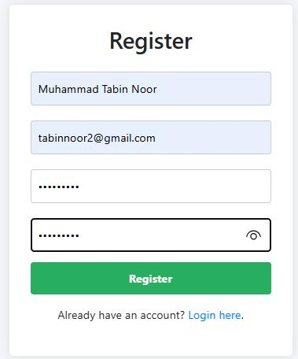
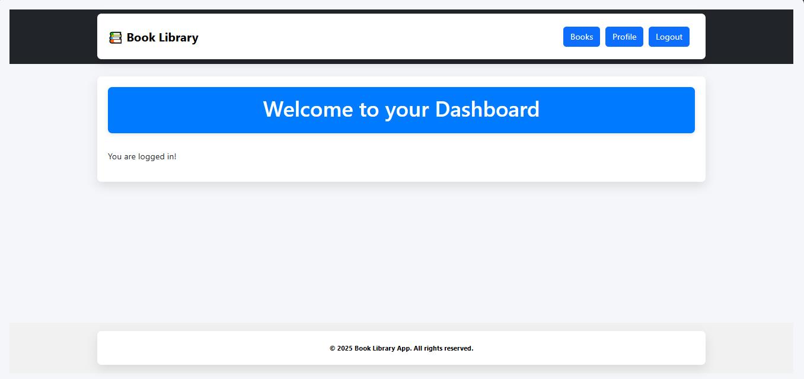
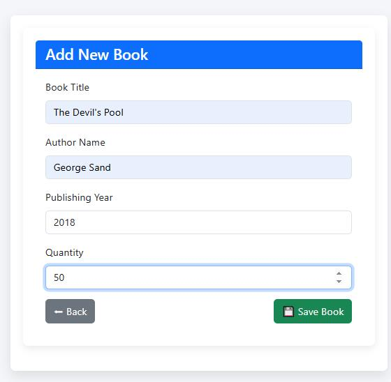
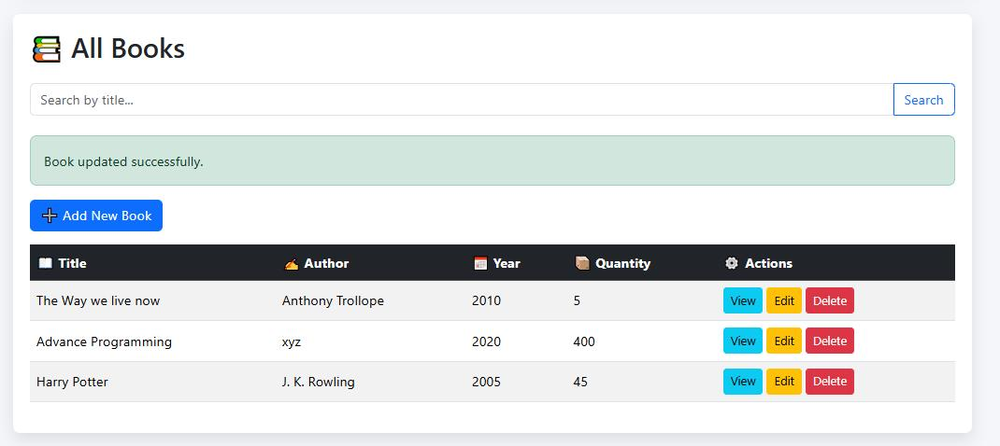
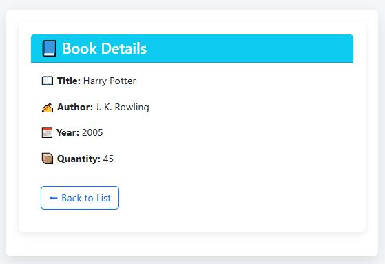
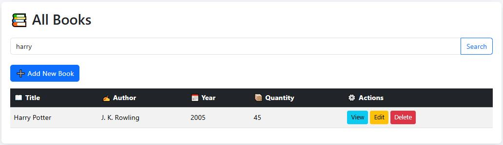
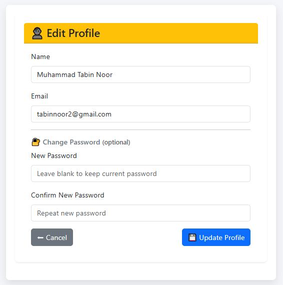

# Laravel Library Management System

This is a Laravel-based Library Management System that provides a simple CRUD interface for managing books. It includes user authentication, registration, and profile management. The interface is built using Blade templates and styled with Bootstrap for a clean and responsive user experience.

---

## 🚀 Features

- User registration, login, and logout  
- User profile editing and deletion  
- Dashboard for logged-in users  
- Book management (Create, Read, Update, Delete)  
- Form validation and flash messaging  
- Clean and responsive UI design  

---

## 🛠️ Tech Stack

- Laravel 10+  
- PHP 8+  
- MySQL (or compatible DB)  
- Blade templating engine  
- Bootstrap 5  
- Vanilla JS & CSS  

---

## ⚙️ Setup Instructions

### 1. Clone the repository:

```bash
git clone https://github.com/tabinnoor/Library-Management.git
cd Library-Management
```

### 2. Install dependencies:

```bash
composer install
npm install && npm run dev
```

### 3. Configure environment:

```bash
cp .env.example .env
php artisan key:generate
```

> Open the `.env` file and update your database credentials.

### 4. Run database migrations:

```bash
php artisan migrate
```

### 5. Start the development server:

```bash
php artisan serve
```

Now visit [http://localhost:8000](http://localhost:8000) in your browser.

---

## 📷 Screenshots

### 📝 Register Page  


### 🔐 Login Page  


### 🏠 Dashboard  


### ➕ Add Book  


### 📚 Book List  


### 📖 Book Details  


### ✏️ Edit Book  


### 🔍 Search by Name  


### 👤 Edit Profile  



---

## 📄 License

This project is open-source and available under the [MIT License](LICENSE).
